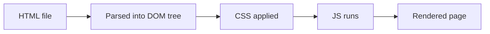

# HTML — Zero to Hero

A complete fundamentals course for beginners — with live examples you can watch render

<div class="pt-8 opacity-70">
Press <kbd>space</kbd> to move on
</div>


<div class="mt-8 opacity-70 text-sm">
  Eng.
  <a href="https://aissamyekhlef.github.io/" target="_blank">Aissam Yekhlef</a>
</div>
<!--
Welcome slide. Introduce yourself and the goal: by the end, students can build
a full, semantic, accessible HTML page from scratch. Most slides from here on
pair a code block with a "Live result" box — the real HTML actually rendered
by the slide itself, not a screenshot.
-->

---
layout: center
---

# What we'll cover

<Toc columns="3" maxDepth="1" />

---
layout: section
---

# 1. What is HTML?

---

# What is HTML?

**HyperText Markup Language** — the standard language for creating web pages.

- **HyperText** → text containing links to other text (hyperlinks)
- **Markup** → tags that describe/structure content, not code logic
- HTML is **not** a programming language — no variables, loops, or conditions
- It works together with **CSS** (styling) and **JavaScript** (behavior)

<div class="grid grid-cols-2 gap-4 mt-4">
<div>

```html
<h1>Hello, world!</h1>
<p>This is a paragraph.</p>
```

</div>
<div class="border border-gray-400/50 rounded-lg p-4">

<span class="text-xs opacity-50">Live result ↓</span>

<h1>Hello, world!</h1>
<p>This is a paragraph.</p>

</div>
</div>

---

# How a browser reads HTML

1. Browser requests an `.html` file from a server
2. It parses the HTML into the **DOM** (Document Object Model) — a tree of elements
3. It applies CSS, runs JavaScript, then **paints** pixels on screen



---
layout: section
---

# 2. Document Structure

---

# The anatomy of an element

```html
<tagname attribute="value">Content</tagname>
```

<v-clicks>

- **Opening tag**: `<p>`
- **Content**: text or other elements
- **Closing tag**: `</p>`
- **Attribute**: extra info inside the opening tag, e.g. `class="intro"`
- Some elements are **self-closing / void** — no content, no closing tag:
  ``, `<br>`, `<input>`, `<hr>`, `<meta>`, `<link>`

</v-clicks>

<div class="border border-gray-400/50 rounded-lg p-4 mt-4">
<span class="text-xs opacity-50">Live result ↓</span>

<p class="intro">A real &lt;p&gt; element with a class attribute — this text is styled by the class, even though you can't see the tag itself.</p>
</div>

---

# The minimal HTML document

```html {all|1|2|3-6|7|8|9-11|all}
<!DOCTYPE html>
<html lang="en">
  <head>
    <meta charset="UTF-8" />
    <meta name="viewport" content="width=device-width, initial-scale=1.0" />
    <title>My First Page</title>
  </head>
  <body>
    <h1>Hello!</h1>
    <p>Welcome to my page.</p>
  </body>
</html>
```

<v-clicks>

- `<!DOCTYPE html>` — tells the browser to use modern HTML5 rules
- `<html lang="en">` — the root element; `lang` helps accessibility & SEO
- `<head>` — metadata, not shown on the page itself
- `<title>` — text shown in the browser tab
- `<body>` — everything the user actually sees, i.e. this whole slide!

</v-clicks>

---

# Metadata in `<head>`

```html
<head>
  <meta charset="UTF-8" />
  <meta name="viewport" content="width=device-width, initial-scale=1.0" />
  <meta name="description" content="A short page summary for search engines" />
  <title>Page Title</title>
  <link rel="stylesheet" href="styles.css" />
  <link rel="icon" href="favicon.ico" />
  <script src="app.js" defer></script>
</head>
```

- `charset` — character encoding (always UTF-8)
- `viewport` — makes the page responsive on mobile
- `description` — used by search engines in results
- `<link>` — connects CSS files / favicons
- `<script defer>` — loads JS without blocking page parsing

<span class="text-xs opacity-50">No live preview here — metadata is invisible by design, it's read by browsers/search engines, not shown on the page.</span>

---
layout: section
---

# 3. Semantic HTML

---

# Why semantics matter

Semantic elements **describe their meaning**, not just their appearance.

```html
<!-- ❌ Non-semantic: a div soup -->
<div class="header">...</div>
<div class="nav">...</div>
<div class="main-content">...</div>

<!-- ✅ Semantic: meaningful structure -->
<header>...</header>
<nav>...</nav>
<main>...</main>
```

<v-click>

**Benefits:** better accessibility (screen readers), better SEO, easier-to-read code, consistent browser behavior. Both examples above look identical — semantics are for machines and assistive tech, not visuals.

</v-click>

---

# The page skeleton — live layout

```html
<body>
  <header>Site logo, title</header>
  <nav>Main navigation links</nav>
  <main>
    <article><section>...</section></article>
    <aside>Related links, ads</aside>
  </main>
  <footer>Copyright, contact info</footer>
</body>
```

<div class="border border-gray-400/50 rounded-lg p-3 mt-2 text-xs">
<span class="opacity-50">Live result — colored boxes = real semantic elements ↓</span>

<header class="bg-blue-500/20 rounded p-2 mb-1">header</header>
<nav class="bg-green-500/20 rounded p-2 mb-1">nav</nav>
<div class="grid grid-cols-3 gap-1 mb-1">
  <main class="bg-yellow-500/20 rounded p-2 col-span-2">main → article → section</main>
  <aside class="bg-purple-500/20 rounded p-2">aside</aside>
</div>
<footer class="bg-red-500/20 rounded p-2">footer</footer>
</div>

---
layout: section
---

# 4. Headings & Text

---

# Headings and document outline

<div class="grid grid-cols-2 gap-4">
<div>

```html
<h1>Heading 1</h1>
<h2>Heading 2</h2>
<h3>Heading 3</h3>
<h4>Heading 4</h4>
<h5>Heading 5</h5>
<h6>Heading 6</h6>
```

</div>
<div class="border border-gray-400/50 rounded-lg p-3">
<span class="text-xs opacity-50">Live result ↓</span>

<h1 style="margin:0.2em 0">Heading 1</h1>
<h2 style="margin:0.2em 0">Heading 2</h2>
<h3 style="margin:0.2em 0">Heading 3</h3>
<h4 style="margin:0.2em 0">Heading 4</h4>
<h5 style="margin:0.2em 0">Heading 5</h5>
<h6 style="margin:0.2em 0">Heading 6</h6>

</div>
</div>

- **Never skip levels** for styling reasons — they define the page **outline**, size is just the browser's default CSS

---

# Text basics

<div class="grid grid-cols-2 gap-4">
<div>

```html
<p>
  Some <strong>important</strong> text
  and some <em>emphasized</em> text.
</p>
<hr />
<blockquote>
  A quoted block of text.
</blockquote>
```

</div>
<div class="border border-gray-400/50 rounded-lg p-3">
<span class="text-xs opacity-50">Live result ↓</span>

<p>Some <strong>important</strong> text and some <em>emphasized</em> text.</p>
<hr />
<blockquote>A quoted block of text.</blockquote>

</div>
</div>

- `<strong>` = important (bold) · `<em>` = stress emphasis (italic) — prefer these over purely-visual `<b>`/`<i>`

---

# Other inline text elements

<div class="grid grid-cols-2 gap-4 text-sm">
<div>

```html
<code>const x = 1;</code>
<mark>highlighted text</mark>
<small>fine print</small>
water = H<sub>2</sub>O
x<sup>2</sup> = area
<abbr title="HyperText Markup Language">HTML</abbr>
```

</div>
<div class="border border-gray-400/50 rounded-lg p-3">
<span class="text-xs opacity-50">Live result — hover the dotted word ↓</span>

<code>const x = 1;</code><br>
<mark>highlighted text</mark><br>
<small>fine print</small><br>
water = H<sub>2</sub>O<br>
x<sup>2</sup> = area<br>
<abbr title="HyperText Markup Language" style="text-decoration:underline dotted">HTML</abbr>

</div>
</div>

---

# `<div>` vs `<span>`, block vs inline

<div class="grid grid-cols-2 gap-4">
<div>

**Block-level** — new line, full width

```html
<div style="border:1px solid">Block A</div>
<div style="border:1px solid">Block B</div>
```

<div class="border border-gray-400/50 rounded p-2 mt-2 text-xs">
<div style="border:1px solid;padding:2px">Block A</div>
<div style="border:1px solid;padding:2px">Block B</div>
</div>

</div>
<div>

**Inline** — stays in the text flow

```html
<span style="border:1px solid">Inline A</span>
<span style="border:1px solid">Inline B</span>
```

<div class="border border-gray-400/50 rounded p-2 mt-2 text-xs">
<span style="border:1px solid;padding:2px">Inline A</span>
<span style="border:1px solid;padding:2px">Inline B</span>
</div>

</div>
</div>

<v-click>

Notice the blocks stack vertically and fill the width; the inline spans sit side-by-side on one line.

</v-click>

---
layout: section
---

# 5. Attributes

---

# Global attributes — live demo

| Attribute | Purpose |
|---|---|
| `id` | Unique identifier (used once per page) |
| `class` | One or more class names for CSS/JS |
| `title` | Extra info shown as a tooltip |
| `data-*` | Custom data, e.g. `data-user-id="42"` |
| `hidden` | Hides the element |

```html
<p id="intro" title="Hover me!" data-user-id="42">Hi there!</p>
```

<div class="border border-gray-400/50 rounded-lg p-3 mt-2">
<span class="text-xs opacity-50">Live result — hover the text below ↓</span>

<p id="intro" title="Hover me! I'm a tooltip from the title attribute." style="cursor:help;display:inline-block">Hi there! (hover me)</p>
</div>

---
layout: section
---

# 6. Links & Navigation

---

# Links — `<a>`

<div class="grid grid-cols-2 gap-4">
<div>

```html
<a href="https://example.com">
  Absolute link
</a>
<a href="#section2">
  Jump to an anchor
</a>
<a href="mailto:hi@example.com">
  Email link
</a>
```

</div>
<div class="border border-gray-400/50 rounded-lg p-3">
<span class="text-xs opacity-50">Live result (click disabled in demo) ↓</span>

<a href="https://example.com" onclick="return false" style="cursor:pointer">Absolute link</a><br>
<a href="#section2" onclick="return false" style="cursor:pointer">Jump to an anchor</a><br>
<a href="mailto:hi@example.com" onclick="return false" style="cursor:pointer">Email link</a>

</div>
</div>

- `target="_blank"` opens a new tab — always pair with `rel="noopener"`

---

# Navigation menus

```html
<nav aria-label="Main">
  <ul>
    <li><a href="/">Home</a></li>
    <li><a href="/about.html">About</a></li>
    <li><a href="/contact.html">Contact</a></li>
  </ul>
</nav>
```

<div class="border border-gray-400/50 rounded-lg p-3 mt-2">
<span class="text-xs opacity-50">Live result ↓</span>

<nav aria-label="Main">
  <ul style="display:flex;gap:1rem;list-style:none;padding:0;margin:0">
    <li><a href="/" onclick="return false" style="cursor:pointer">Home</a></li>
    <li><a href="/about.html" onclick="return false" style="cursor:pointer">About</a></li>
    <li><a href="/contact.html" onclick="return false" style="cursor:pointer">Contact</a></li>
  </ul>
</nav>

</div>

---
layout: section
---

# 7. Lists

---

# Lists — three kinds

<div class="grid grid-cols-3 gap-3 text-sm">
<div>

**Unordered**
```html
<ul>
  <li>Tea</li>
  <li>Coffee</li>
</ul>
```
<div class="border rounded p-2 mt-1">
<ul><li>Tea</li><li>Coffee</li></ul>
</div>

</div>
<div>

**Ordered**
```html
<ol>
  <li>Step one</li>
  <li>Step two</li>
</ol>
```
<div class="border rounded p-2 mt-1">
<ol><li>Step one</li><li>Step two</li></ol>
</div>

</div>
<div>

**Description**
```html
<dl>
  <dt>HTML</dt>
  <dd>Structure</dd>
</dl>
```
<div class="border rounded p-2 mt-1">
<dl style="margin:0"><dt>HTML</dt><dd>Structure</dd></dl>
</div>

</div>
</div>

---
layout: center
---

# 🛝 Playground: `<ul>` vs `<ol>` vs `<dl>`

Click a button — the code and the rendered result update together

<script setup>
import { ref } from 'vue'
const kind = ref('ul')
const examples = {
  ul: {
    code: `<ul>\n  <li>Tea</li>\n  <li>Coffee</li>\n  <li>Milk</li>\n</ul>`,
    tip: 'Use <ul> when the ORDER doesn\'t matter — a shopping list, a set of tags, features on a pricing card.',
  },
  ol: {
    code: `<ol>\n  <li>Preheat the oven</li>\n  <li>Mix the batter</li>\n  <li>Bake 20 minutes</li>\n</ol>`,
    tip: 'Use <ol> when SEQUENCE matters — a recipe, step-by-step instructions, race results.',
  },
  dl: {
    code: `<dl>\n  <dt>HTML</dt>\n  <dd>Structures content</dd>\n  <dt>CSS</dt>\n  <dd>Styles content</dd>\n</dl>`,
    tip: 'Use <dl> for TERM / DEFINITION pairs — a glossary, an FAQ, metadata key-value pairs.',
  },
}
</script>

<div class="flex gap-2 justify-center my-4">
  <button @click="kind = 'ul'" class="px-4 py-2 rounded-lg border" :class="kind==='ul' ? 'bg-blue-500 text-white border-blue-500' : 'border-gray-400/50'">&lt;ul&gt; unordered</button>
  <button @click="kind = 'ol'" class="px-4 py-2 rounded-lg border" :class="kind==='ol' ? 'bg-blue-500 text-white border-blue-500' : 'border-gray-400/50'">&lt;ol&gt; ordered</button>
  <button @click="kind = 'dl'" class="px-4 py-2 rounded-lg border" :class="kind==='dl' ? 'bg-blue-500 text-white border-blue-500' : 'border-gray-400/50'">&lt;dl&gt; description</button>
</div>

<div class="grid grid-cols-2 gap-4 text-left max-w-3xl mx-auto">
<div>

<span class="text-xs opacity-50">Code</span>

<pre class="slidev-code shiki" style="background:#1e1e1e;color:#d4d4d4;padding:1rem;border-radius:6px;font-size:0.8em;overflow-x:auto;white-space:pre-wrap;margin:0"><code>{{ examples[kind].code }}</code></pre>

</div>
<div class="border border-gray-400/50 rounded-lg p-4">
<span class="text-xs opacity-50">Live result</span>

<ul v-if="kind==='ul'"><li>Tea</li><li>Coffee</li><li>Milk</li></ul>
<ol v-if="kind==='ol'"><li>Preheat the oven</li><li>Mix the batter</li><li>Bake 20 minutes</li></ol>
<dl v-if="kind==='dl'" style="margin:0"><dt>HTML</dt><dd>Structures content</dd><dt>CSS</dt><dd>Styles content</dd></dl>

</div>
</div>

<p class="text-sm mt-4 max-w-2xl mx-auto opacity-80">{{ examples[kind].tip }}</p>

<!--
This slide uses a per-slide <script setup> block, a native Slidev/Vue feature.
If your Slidev version doesn't pick it up, move the script + template into a
reusable component under components/ListPlayground.vue and use <ListPlayground />
here instead — same idea, just extracted.
-->

---
layout: section
---

# 8. Tables

---

# Tables — structuring tabular data

```html {all|2-6|8-12|all}
<table>
  <thead>
    <tr><th>Name</th><th>Score</th></tr>
  </thead>
  <tbody>
    <tr><td>Alice</td><td>92</td></tr>
    <tr><td>Bilal</td><td>87</td></tr>
  </tbody>
</table>
```

<div class="border border-gray-400/50 rounded-lg p-3 mt-2">
<span class="text-xs opacity-50">Live result ↓</span>

<table style="border-collapse:collapse;width:100%">
<thead><tr><th style="border:1px solid;padding:4px">Name</th><th style="border:1px solid;padding:4px">Score</th></tr></thead>
<tbody>
<tr><td style="border:1px solid;padding:4px">Alice</td><td style="border:1px solid;padding:4px">92</td></tr>
<tr><td style="border:1px solid;padding:4px">Bilal</td><td style="border:1px solid;padding:4px">87</td></tr>
</tbody>
</table>

</div>

- ⚠️ Never use tables for page layout — only for real tabular data

---
layout: section
---

# 9. Images & Media

---

# Images — ``

```html

<figure>
  
  <figcaption>Figure 1: Q1 sales grew 12%</figcaption>
</figure>
```

<div class="border border-gray-400/50 rounded-lg p-3 mt-2 flex gap-6 items-start">
<span class="text-xs opacity-50 w-full block">Live result — placeholder graphics stand in for real photos ↓</span>


<figure style="margin:0">
  
  <figcaption style="font-size:0.75em">Figure 1: Q1 sales grew 12%</figcaption>
</figure>

</div>

- `alt` is **required**, `width`/`height` prevent layout shift, `loading="lazy"` improves performance

---

# Audio & Video

```html
<audio controls>
  <source src="song.mp3" type="audio/mpeg" />
</audio>

<video controls width="320" poster="preview.jpg">
  <source src="movie.mp4" type="video/mp4" />
  <track kind="subtitles" src="subs-en.vtt" srclang="en" />
</video>
```

- `controls` shows play/pause/volume UI
- Multiple `<source>` tags offer format fallbacks
- `<track>` adds captions/subtitles for accessibility
- <span class="opacity-60">No live preview — needs real media files, which this deck doesn't ship. The `<details>` slide coming up renders live instead.</span>

---
layout: section
---

# 10. Forms

---

# Forms — the container

```html
<form onsubmit="return false">
  <label for="name">Name</label>
  <input type="text" id="name" name="name" required />
  <button type="submit">Send</button>
</form>
```

<div class="border border-gray-400/50 rounded-lg p-3 mt-2">
<span class="text-xs opacity-50">Live result — try submitting empty, the browser validates it ↓</span>

<form onsubmit="return false" style="display:flex;gap:0.5rem;align-items:end">
  <div><label for="name" style="display:block;font-size:0.8em">Name</label><input type="text" id="name" name="name" required style="border:1px solid;padding:2px 4px" /></div>
  <button type="submit" style="border:1px solid;padding:2px 8px">Send</button>
</form>

</div>

- **Always** pair `<label for="id">` with the input's matching `id` — accessibility essential

---

# Common input types — live demo

<div class="border border-gray-400/50 rounded-lg p-3 grid grid-cols-2 gap-2 text-sm">
<span class="text-xs opacity-50 col-span-2">Type in these — each gives a different keyboard/UI ↓</span>

<label>text <input type="text" style="border:1px solid;padding:2px"/></label>
<label>email <input type="email" style="border:1px solid;padding:2px"/></label>
<label>number <input type="number" min="0" max="10" style="border:1px solid;padding:2px;width:4em"/></label>
<label>date <input type="date" style="border:1px solid;padding:2px"/></label>
<label>checkbox <input type="checkbox"/></label>
<label>range <input type="range" min="0" max="100"/></label>

</div>

```html
<input type="text" /> <input type="email" />
<input type="number" min="0" max="10" />
<input type="date" /> <input type="checkbox" />
<input type="range" min="0" max="100" />
```

---

# Select, textarea, and buttons — edit the code, watch it render

<script setup>
import { ref } from 'vue'
const formCode = ref(`<select>
  <option value="dz">Algeria</option>
  <option value="fr">France</option>
</select>
<textarea rows="2">Type here...</textarea>
<button type="button">Submit</button>`)
</script>

<div class="grid grid-cols-2 gap-4">
<div>

<span class="text-xs opacity-50">Edit this code ↓</span>

<textarea v-model="formCode" rows="9" class="w-full font-mono" style="background:#1e1e1e;color:#d4d4d4;padding:0.75rem;border-radius:6px;border:none;font-size:0.75em;resize:vertical"></textarea>

</div>
<div class="border border-gray-400/50 rounded-lg p-3">

<span class="text-xs opacity-50">Live result ↓</span>

<div v-html="formCode" class="flex gap-3 items-start flex-wrap mt-2"></div>

</div>
</div>

<p class="text-xs opacity-60 mt-3">Try adding <code>&lt;option value="uk"&gt;United Kingdom&lt;/option&gt;</code> inside the &lt;select&gt; on the left, or change <code>type="button"</code> to <code>type="submit"</code> — the preview updates as you type.</p>

---
layout: section
---

# 11. More Useful Elements

---

# `<details>` & `<summary>` — click to try it

```html
<details>
  <summary>Click to expand</summary>
  <p>Hidden content shown when opened — no JavaScript needed!</p>
</details>
```

<div class="border border-gray-400/50 rounded-lg p-3 mt-2">
<span class="text-xs opacity-50">Live result — click the summary below ↓</span>

<details>
  <summary style="cursor:pointer">Click to expand</summary>
  <p>Hidden content shown when opened — no JavaScript needed!</p>
</details>

</div>

---

# `<iframe>` — embedding another document

```html
<iframe srcdoc="<h1>Hello from inside!</h1><p>I'm a separate document.</p>">
</iframe>
```

<div class="border border-gray-400/50 rounded-lg p-3 mt-2">
<span class="text-xs opacity-50">Live result — this really is a separate embedded document ↓</span>

<iframe srcdoc="&lt;body style='font-family:sans-serif'&gt;&lt;h3&gt;Hello from inside!&lt;/h3&gt;&lt;p&gt;I'm a separate document, loaded via srcdoc.&lt;/p&gt;&lt;/body&gt;" style="width:100%;height:100px;border:1px solid"></iframe>

</div>

- In real projects you'd point `src` at a URL (maps, videos, widgets) — always add a `title` for accessibility

---
layout: section
---

# 12. Accessibility Basics

---

# Writing accessible HTML

<v-clicks>

- Use **real semantic elements** (`<button>`, `<nav>`) instead of styled `<div>`s
- Every `` needs a meaningful `alt` (or `alt=""` if purely decorative)
- Every form `<input>` needs a linked `<label>`
- Keep a logical **heading order** — no skipping levels
- Use `lang` on `<html>` so screen readers pick the right voice
- Ensure interactive elements work with the **keyboard alone** — try Tab right now!

</v-clicks>

<div class="border border-gray-400/50 rounded-lg p-3 mt-4 text-sm">
<span class="text-xs opacity-50">Live result — click here then press Tab a few times ↓</span>
<a href="#" onclick="return false" style="margin-right:1rem">Link one</a>
<button style="border:1px solid;padding:2px 6px;margin-right:1rem">Button</button>
<input type="text" placeholder="Input" style="border:1px solid;padding:2px"/>
</div>

---
layout: section
---

# 13. Putting It All Together

---

# A complete mini page

```html {monaco} {height:'400px'}
<!DOCTYPE html>
<html lang="en">
<head>
  <meta charset="UTF-8" />
  <meta name="viewport" content="width=device-width, initial-scale=1.0" />
  <title>My Portfolio</title>
</head>
<body>
  <header>
    <h1>Aissam Yekhlef</h1>
    <nav>
      <ul>
        <li><a href="#projects">Projects</a></li>
        <li><a href="#contact">Contact</a></li>
      </ul>
    </nav>
  </header>

  <main>
    <section id="projects">
      <h2>Projects</h2>
      <article>
        <h3>Weather App</h3>
        <p>Built with <strong>Vue.js</strong> and a public API.</p>
        <a href="https://example.com" target="_blank" rel="noopener">View project</a>
      </article>
    </section>

    <section id="contact">
      <h2>Contact me</h2>
      <form>
        <label for="email">Email</label>
        <input type="email" id="email" name="email" required />
        <button type="submit">Send</button>
      </form>
    </section>
  </main>

  <footer>
    <p>&copy; 2026 Aissam Yekhlef</p>
  </footer>
</body>
</html>
```

---
layout: section
---

# 14. Common Beginner Mistakes

---

# Avoid these mistakes

<v-clicks>

- Forgetting `alt` on `` or `for`/`id` on labels
- Using `<div>`/`<span>` for everything instead of semantic tags
- Skipping heading levels for visual size (use CSS for size instead)
- Nesting block elements inside inline elements (e.g. `<div>` inside `<span>`)
- Not closing tags, or closing them in the wrong order
- Multiple `<h1>` or multiple `<main>` elements on one page
- Using tables for layout instead of tabular data
- Forgetting the viewport `<meta>` tag → broken mobile layouts

</v-clicks>

---
layout: section
---

# Next Steps

---

# Where to go from here

1. **Practice** — rebuild a simple real website's structure from scratch
2. **Validate** your HTML with the [W3C Validator](https://validator.w3.org/)
3. Learn **CSS** next to style what you've structured
4. Then **JavaScript** to add interactivity
5. Explore deeper topics: `<template>`, Shadow DOM, HTML APIs, Web Components

<br>

**Reference material used for this course:**
- web.dev — Learn HTML: https://web.dev/learn/html
- W3Schools — HTML Tutorial: https://www.w3schools.com/html/

---
layout: center
class: text-center
---

# You're ready to build! 🚀

From `<!DOCTYPE html>` to a full semantic page — questions?

---
layout: center
class: text-center
---

# Thank You

Created by:
[Aissam Yekhlef](https://aissamyekhlef.github.io/)