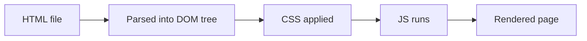

# HTML — Zero to Hero
 
A complete fundamentals course for beginners
 
<div class="pt-8 opacity-70">
Press <kbd>space</kbd> to move on
</div>
<!--
Welcome slide. Introduce yourself and the goal: by the end, students can build
a full, semantic, accessible HTML page from scratch.
-->
 
---
layout: center
---
 
# What we'll cover
 
<Toc columns="2" maxDepth="1" />
---
layout: section
---
 
# 1. What is HTML?
 
---
 
# What is HTML?
 
**HyperText Markup Language** — the standard language for creating web pages.
 
- **HyperText** → text containing links to other text (hyperlinks)
- **Markup** → tags that describe/structure content, not code logic
- HTML is **not** a programming language — no variables, loops, or conditions
- It works together with:
  - **CSS** → styling and layout
  - **JavaScript** → behavior and interactivity
<br>
```html
<h1>Hello, world!</h1>
<p>This is a paragraph.</p>
```
 
---
 
# How a browser reads HTML
 
1. Browser requests an `.html` file from a server
2. It parses the HTML into the **DOM** (Document Object Model) — a tree of elements
3. It applies CSS, runs JavaScript, then **paints** pixels on screen

 
---
layout: section
---
 
# 2. Document Structure
 
---
 
# The anatomy of an element
 
```html
<tagname attribute="value">Content</tagname>
```
 
<v-clicks>
- **Opening tag**: `<p>`
- **Content**: text or other elements
- **Closing tag**: `</p>`
- **Attribute**: extra info inside the opening tag, e.g. `class="intro"`
- Some elements are **self-closing / void** — no content, no closing tag:
  ``, `<br>`, `<input>`, `<hr>`, `<meta>`, `<link>`
</v-clicks>
---
 
# The minimal HTML document
 
```html {all|1|2|3-6|7|8|9-11|all}
<!DOCTYPE html>
<html lang="en">
  <head>
    <meta charset="UTF-8" />
    <meta name="viewport" content="width=device-width, initial-scale=1.0" />
    <title>My First Page</title>
  </head>
  <body>
    <h1>Hello!</h1>
    <p>Welcome to my page.</p>
  </body>
</html>
```
 
<v-clicks>
- `<!DOCTYPE html>` — tells the browser to use modern HTML5 rules
- `<html lang="en">` — the root element; `lang` helps accessibility & SEO
- `<head>` — metadata, not shown on the page itself
- `<title>` — text shown in the browser tab
- `<body>` — everything the user actually sees
</v-clicks>
---
 
# Metadata in `<head>`
 
```html
<head>
  <meta charset="UTF-8" />
  <meta name="viewport" content="width=device-width, initial-scale=1.0" />
  <meta name="description" content="A short page summary for search engines" />
  <title>Page Title</title>
  <link rel="stylesheet" href="styles.css" />
  <link rel="icon" href="favicon.ico" />
  <script src="app.js" defer></script>
</head>
```
 
- `charset` — character encoding (always UTF-8)
- `viewport` — makes the page responsive on mobile
- `description` — used by search engines in results
- `<link>` — connects CSS files / favicons
- `<script defer>` — loads JS without blocking page parsing
---
layout: section
---
 
# 3. Semantic HTML
 
---
 
# Why semantics matter
 
Semantic elements **describe their meaning**, not just their appearance.
 
```html
<!-- ❌ Non-semantic: a div soup -->
<div class="header">...</div>
<div class="nav">...</div>
<div class="main-content">...</div>
 
<!-- ✅ Semantic: meaningful structure -->
<header>...</header>
<nav>...</nav>
<main>...</main>
```
 
<v-click>
**Benefits:** better accessibility (screen readers), better SEO, easier-to-read code, consistent browser behavior.
 
</v-click>
---
 
# The page skeleton
 
```html
<body>
  <header>Site logo, title</header>
  <nav>Main navigation links</nav>
  <main>
    <article>
      <section>...</section>
    </article>
    <aside>Related links, ads</aside>
  </main>
  <footer>Copyright, contact info</footer>
</body>
```
 
<div class="grid grid-cols-2 gap-4 mt-4 text-sm">
<div>
- `<header>` — intro / navigation area
- `<nav>` — major navigation links
- `<main>` — the page's unique content (one per page)
</div>
<div>
- `<article>` — self-contained, reusable content (a post, a card)
- `<section>` — thematic grouping, usually with a heading
- `<aside>` — tangential content
- `<footer>` — closing info
</div>
</div>
---
layout: section
---
 
# 4. Headings & Text
 
---
 
# Headings and document outline
 
```html
<h1>Page title (only one per page)</h1>
<h2>Major section</h2>
<h3>Subsection</h3>
...
<h6>Smallest heading</h6>
```
 
- Six levels: `<h1>`–`<h6>`
- **Never skip levels** for styling reasons — they define the page **outline**
- Screen reader users navigate by headings — structure matters more than size
---
 
# Text basics
 
```html
<p>A paragraph of text.</p>
 
<p>
  Some <strong>important</strong> text and some <em>emphasized</em> text.
  <br />
  A line break above. Below is a rule:
</p>
<hr />
 
<blockquote cite="https://example.com">
  A quoted block of text from another source.
</blockquote>
```
 
- `<strong>` = important (bold) · `<em>` = stress emphasis (italic)
- `<b>` / `<i>` exist but are purely visual — prefer `<strong>` / `<em>`
- `<br>` = line break · `<hr>` = thematic break (horizontal rule)
---
 
# Other inline text elements
 
<div class="grid grid-cols-2 gap-4 text-sm">
<div>
```html
<code>const x = 1;</code>
<pre>preformatted
  text block</pre>
<mark>highlighted text</mark>
<small>fine print</small>
<sub>H<sub>2</sub>O</sub>
<sup>x<sup>2</sup></sup>
<abbr title="HyperText Markup Language">
  HTML
</abbr>
```
 
</div>
<div>
- `<code>` — inline code snippet
- `<pre>` — preserves whitespace/line breaks
- `<mark>` — highlighted/relevant text
- `<small>` — side comments, fine print
- `<sub>` / `<sup>` — subscript / superscript
- `<abbr>` — abbreviation with a tooltip
</div>
</div>
---
 
# `<div>` vs `<span>`, block vs inline
 
<div class="grid grid-cols-2 gap-4">
<div>
**Block-level** — starts on a new line, takes full width
 
```html
<div>A generic block container</div>
<p>...</p> <h1>...</h1> <ul>...</ul>
```
 
</div>
<div>
**Inline** — stays in the text flow
 
```html
<span>A generic inline container</span>
<a>...</a> <strong>...</strong> 
```
 
</div>
</div>
<v-click>
Use `<div>` / `<span>` only when **no semantic element fits** — they carry no meaning, just structure/styling hooks.
 
</v-click>
---
layout: section
---
 
# 5. Attributes
 
---
 
# Global attributes
 
Attributes usable on (almost) **any** element:
 
| Attribute | Purpose |
|---|---|
| `id` | Unique identifier (used once per page) |
| `class` | One or more class names for CSS/JS |
| `style` | Inline CSS (avoid — use stylesheets instead) |
| `title` | Extra info shown as a tooltip |
| `lang` | Language of the element's content |
| `hidden` | Hides the element |
| `tabindex` | Controls keyboard focus order |
| `data-*` | Custom data, e.g. `data-user-id="42"` |
| `contenteditable` | Makes content directly editable |
 
```html
<p id="intro" class="lead" data-user-id="42" title="Introduction">Hi!</p>
```
 
---
layout: section
---
 
# 6. Links & Navigation
 
---
 
# Links — `<a>`
 
```html
<a href="https://example.com">Absolute link (full URL)</a>
<a href="/about.html">Root-relative link</a>
<a href="about.html">Relative link (same folder)</a>
<a href="../images/photo.jpg">Relative, one folder up</a>
 
<a href="https://example.com" target="_blank" rel="noopener">
  Opens in a new tab (safely)
</a>
 
<a href="#section2">Jump to an in-page anchor</a>
<a href="mailto:hi@example.com">Email link</a>
<a href="tel:+123456789">Phone link</a>
```
 
- `target="_blank"` opens a new tab — always pair with `rel="noopener"`
- Anchor links jump to an element with a matching `id`, e.g. `id="section2"`
---
 
# Navigation menus
 
```html
<nav aria-label="Main">
  <ul>
    <li><a href="/">Home</a></li>
    <li><a href="/about.html">About</a></li>
    <li><a href="/contact.html">Contact</a></li>
  </ul>
</nav>
```
 
- Wrap navigation links in `<nav>` + a list (`<ul>/<li>`) — semantic and accessible
- `aria-label` helps distinguish multiple `<nav>` regions on one page
---
layout: section
---
 
# 7. Lists
 
---
 
# Lists
 
<div class="grid grid-cols-2 gap-4">
<div>
**Unordered** (bullets)
 
```html
<ul>
  <li>Tea</li>
  <li>Coffee</li>
  <li>Milk</li>
</ul>
```
 
**Ordered** (numbered)
 
```html
<ol start="3">
  <li>Step one</li>
  <li>Step two</li>
</ol>
```
 
</div>
<div>
**Description list** (term/definition pairs)
 
```html
<dl>
  <dt>HTML</dt>
  <dd>Structures content</dd>
  <dt>CSS</dt>
  <dd>Styles content</dd>
</dl>
```
 
Lists can nest inside each other for sub-items.
 
</div>
</div>
---
layout: section
---
 
# 8. Tables
 
---
 
# Tables — structuring tabular data
 
```html {all|2-6|8-12|all}
<table>
  <thead>
    <tr>
      <th>Name</th>
      <th>Score</th>
    </tr>
  </thead>
  <tbody>
    <tr>
      <td>Alice</td>
      <td>92</td>
    </tr>
  </tbody>
</table>
```
 
- `<table>` → `<thead>` / `<tbody>` / `<tfoot>` → `<tr>` (row) → `<th>`/`<td>` (cells)
- `<th scope="col">` labels a column, `<th scope="row">` labels a row
- `colspan="2"` / `rowspan="2"` merge cells
- ⚠️ Never use tables for page layout — only for real tabular data
---
layout: section
---
 
# 9. Images & Media
 
---
 
# Images — ``
 
```html

```
 
- `alt` is **required** — describes the image for screen readers & when it fails to load
- `width` / `height` prevent layout shift while loading
- `loading="lazy"` defers off-screen images for performance
```html
<figure>
  
  <figcaption>Figure 1: Q1 sales grew 12%</figcaption>
</figure>
```
 
`<figure>` + `<figcaption>` — an image (or diagram/code) with a caption
 
---
 
# Audio & Video
 
```html
<audio controls>
  <source src="song.mp3" type="audio/mpeg" />
  Your browser doesn't support audio.
</audio>
 
<video controls width="480" poster="preview.jpg">
  <source src="movie.mp4" type="video/mp4" />
  <track kind="subtitles" src="subs-en.vtt" srclang="en" />
  Your browser doesn't support video.
</video>
```
 
- `controls` shows play/pause/volume UI
- Multiple `<source>` tags offer format fallbacks
- `<track>` adds captions/subtitles for accessibility
---
layout: section
---
 
# 10. Forms
 
---
 
# Forms — the container
 
```html
<form action="/submit" method="post">
  <label for="name">Name</label>
  <input type="text" id="name" name="name" required />
 
  <button type="submit">Send</button>
</form>
```
 
- `action` — where the data is sent · `method` — `get` (URL) or `post` (body)
- **Always** pair `<label for="id">` with an input's matching `id` — accessibility essential
- `name` is the key sent to the server; `required` adds built-in validation
---
 
# Common input types
 
```html
<input type="text" />
<input type="email" />
<input type="password" />
<input type="number" min="0" max="10" />
<input type="checkbox" />
<input type="radio" name="plan" />
<input type="date" />
<input type="file" />
<input type="range" min="0" max="100" />
```
 
<div class="grid grid-cols-2 gap-4 text-sm mt-2">
<div>
- Semantic types (`email`, `date`, `number`) give the right **keyboard on mobile** and **built-in validation**
</div>
<div>
- Radios sharing the same `name` are mutually exclusive; checkboxes are independent
</div>
</div>
---
 
# Select, textarea, and buttons
 
```html
<label for="country">Country</label>
<select id="country" name="country">
  <option value="dz">Algeria</option>
  <option value="fr">France</option>
</select>
 
<label for="bio">Bio</label>
<textarea id="bio" name="bio" rows="4"></textarea>
 
<button type="submit">Submit</button>
<button type="reset">Reset</button>
<button type="button">Just a click handler</button>
```
 
- `<select>` — dropdown of `<option>`s
- `<textarea>` — multi-line text input
- `type="button"` does nothing on its own — used for JS-driven actions
---
layout: section
---
 
# 11. More Useful Elements
 
---
 
# `<details>`, `<summary>` & `<dialog>`
 
```html
<details>
  <summary>Click to expand</summary>
  <p>Hidden content shown when opened — no JavaScript needed!</p>
</details>
 
<dialog open>
  <p>I'm a native modal dialog.</p>
  <button onclick="this.closest('dialog').close()">Close</button>
</dialog>
```
 
- `<details>`/`<summary>` — a built-in, accessible collapsible/accordion
- `<dialog>` — a native modal/pop-up box; open with `.showModal()` in JS
---
 
# `<iframe>` — embedding other pages
 
```html
<iframe
  src="https://www.youtube.com/embed/xyz"
  title="Video: Introduction to HTML"
  width="560"
  height="315"
  loading="lazy"
></iframe>
```
 
- Embeds another full document (maps, videos, widgets) inside your page
- Always give it a `title` for accessibility
- Comments and entities:
```html
<!-- This is a comment, ignored by the browser -->
<p>5 &lt; 10 &amp;&amp; 10 &gt; 5</p>   <!-- &lt; &gt; &amp; &nbsp; -->
```
 
---
layout: section
---
 
# 12. Accessibility Basics
 
---
 
# Writing accessible HTML
 
<v-clicks>
- Use **real semantic elements** (`<button>`, `<nav>`) instead of styled `<div>`s
- Every `` needs a meaningful `alt` (or `alt=""` if purely decorative)
- Every form `<input>` needs a linked `<label>`
- Keep a logical **heading order** (`h1` → `h2` → `h3`, no skipping)
- Use `lang` on `<html>` so screen readers pick the right voice
- Ensure interactive elements are reachable and usable with the **keyboard alone**
- Use ARIA attributes (`aria-label`, `aria-hidden`) only when no native element fits
</v-clicks>
---
layout: section
---
 
# 13. Putting It All Together
 
---
 
# A complete mini page
 
```html {monaco}
<!DOCTYPE html>
<html lang="en">
<head>
  <meta charset="UTF-8" />
  <meta name="viewport" content="width=device-width, initial-scale=1.0" />
  <title>My Portfolio</title>
</head>
<body>
  <header>
    <h1>Aissam Yekhlef</h1>
    <nav>
      <ul>
        <li><a href="#projects">Projects</a></li>
        <li><a href="#contact">Contact</a></li>
      </ul>
    </nav>
  </header>
 
  <main>
    <section id="projects">
      <h2>Projects</h2>
      <article>
        <h3>Weather App</h3>
        <p>Built with <strong>Vue.js</strong> and a public API.</p>
        <a href="https://example.com" target="_blank" rel="noopener">View project</a>
      </article>
    </section>
 
    <section id="contact">
      <h2>Contact me</h2>
      <form>
        <label for="email">Email</label>
        <input type="email" id="email" name="email" required />
        <button type="submit">Send</button>
      </form>
    </section>
  </main>
 
  <footer>
    <p>&copy; 2026 Aissam Yekhlef</p>
  </footer>
</body>
</html>
```
 
---
layout: section
---
 
# 14. Common Beginner Mistakes
 
---
 
# Avoid these mistakes
 
<v-clicks>
- Forgetting `alt` on `` or `for`/`id` on labels
- Using `<div>`/`<span>` for everything instead of semantic tags
- Skipping heading levels for visual size (use CSS for size instead)
- Nesting block elements inside inline elements (e.g. `<div>` inside `<span>`)
- Not closing tags, or closing them in the wrong order
- Multiple `<h1>` or multiple `<main>` elements on one page
- Using tables for layout instead of tabular data
- Forgetting the viewport `<meta>` tag → broken mobile layouts
</v-clicks>
---
layout: section
---
 
# Next Steps
 
---
 
# Where to go from here
 
1. **Practice** — rebuild a simple real website's structure from scratch
2. **Validate** your HTML with the [W3C Validator](https://validator.w3.org/)
3. Learn **CSS** next to style what you've structured
4. Then **JavaScript** to add interactivity
5. Explore deeper topics: `<template>`, Shadow DOM, HTML APIs, Web Components
<br>
**Reference material used for this course:**
- web.dev — Learn HTML: https://web.dev/learn/html
- W3Schools — HTML Tutorial: https://www.w3schools.com/html/
---
layout: center
class: text-center
---
 
# You're ready to build! 🚀
 
From `<!DOCTYPE html>` to a full semantic page — questions?
 
---
layout: center
class: text-center
---

# Thank You

Created by:
[Aissam Yekhlef](https://aissamyekhlef.github.io/)
